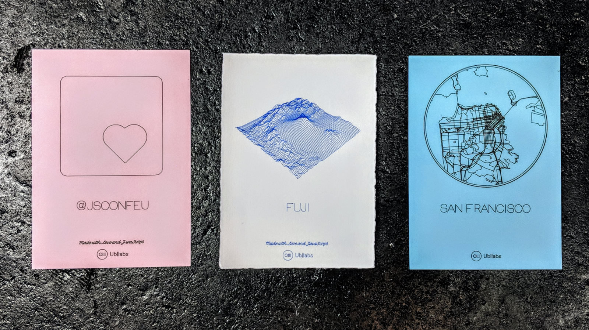
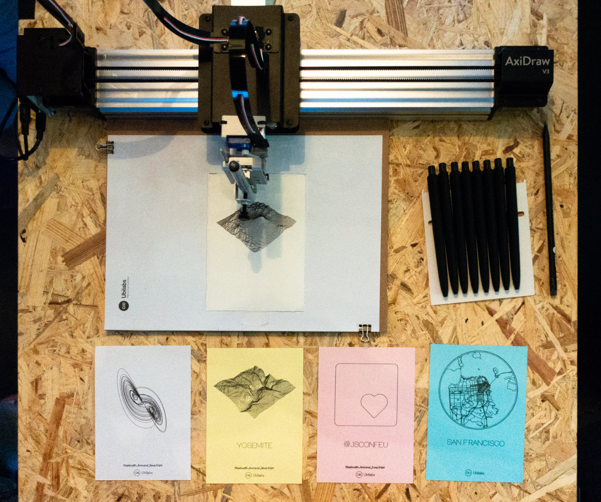
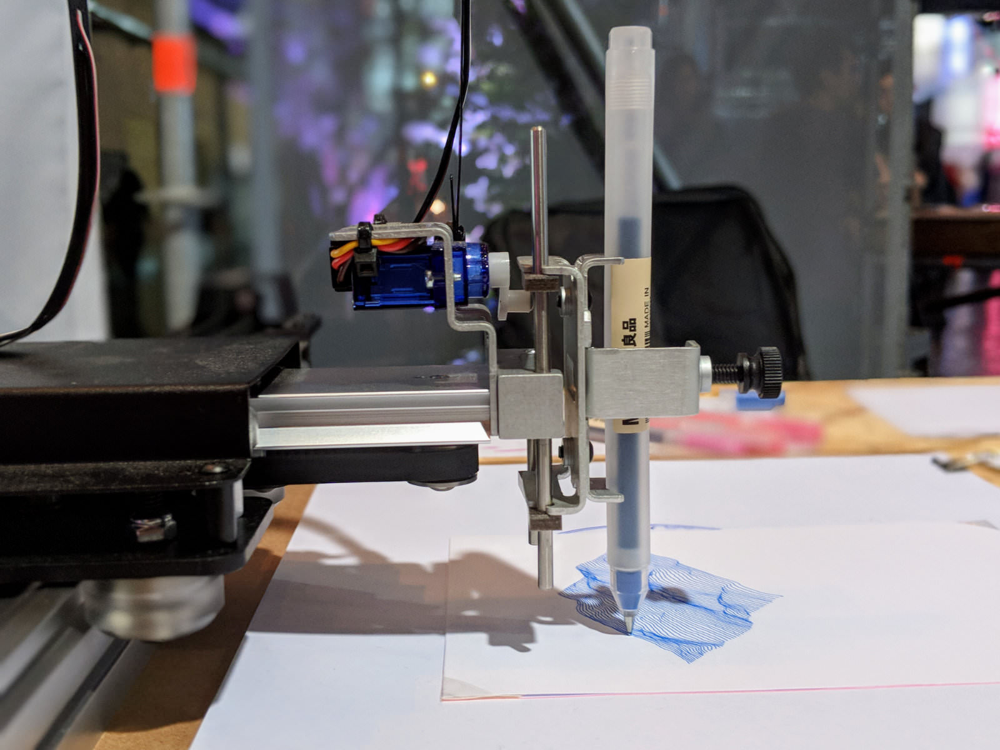

# AxiDrawJS

## Description

AxiDrawJS allows you to use JavaScript to draw on any flat surface with an [AxiDraw](https://www.axidraw.com/).

> The AxiDraw V3 is a simple, modern, and precise pen plotter, capable of writing or drawing on almost any flat surface. It can write with fountain pens, permanent markers, and a variety of other writing implements to handle an endless number of applications.


## Examples

This repository includes some basic APIs and the following examples:

* Map - choose a city and draw the streets
* Terrain - pseudo 3D map for mountains and hills
* Lorenz - the well known Lorenz attractor
* JSConf - the logo of our favourite conference
* Label Only - to draw it using a different color 
* Bounds - the reference paper size
* Adjust Pen - guide to calibrate the plotter

## Sample Prints



## Development

Note: This project was build and tested on OSX. Use with care on other platforms.

### Prerequisites

Make sure you have the following tools installed:

* [Node.js](https://nodejs.org/)
* [npm](https://www.npmjs.com/)

Also, you’ll need a USB port.

### Installation

Download or clone the repository, then install all dependencies:

```sh
npm install
```

### Develop

Run the following command to start the server on localhost:

```sh
npm start
```

If the AxiDraw is not connected, the server starts in simulator mode. To visit the simulation go to http://localhost:8080. The CNC-Server will start on http://localhost:4242.

### Setup AxiDraw

1. Connect your AxiDraw to power and via USB to your computer.
1. Start the server as explained above. It should log out `CONNECTSERIAL CONNECT!` to show that it found the AxiDraw.
1. Go to http://localhost:8080/adjust-pen.html and follow the instructions.
1. For drawing the reference borders go to http://localhost:8080/draw-bounds.html and press `Print` to draw the bounds of the cards. Note: we’re using cards with the size DIN A6.
1. Place a card on the reference borders and you’re ready to go!
1. On http://localhost:4242 you can see the CNC management board with the progress and further options.


### Brew Your Own

To create your own drawings you should start with the high level `Plotter` class from [src/lib/plot-coords.js](/src/lib/plot-coords.js). 

See [src/draw-lorenz.js](/src/draw-lorenz.js) and [html/draw-lorenz.html](/html/draw-lorenz.html) for a basic example. _Note:_ This requires some bolierplate HTML tags (such as a `#preview` SVG) and styles. The final paper size is 496x700 pixel and equal to the DIN A6 paper format. 

Basic JavaScript outline:

```js
import Plotter from './lib/plot-coords';
const plotter = new Plotter();
plotter.coords = [...]; // assign the coords
plotter.print(); // start drawing
```

If you like to have more control over the robot use the low level API from [src/lib/axidraw.js](/src/lib/axidraw.js):

```js
import createAxidraw from "./lib/axidraw";
const axidraw = await createAxidraw();
const coords = [...]; // a list of lines 

for (let i = 0; i < coords.length; i++) {
  const line = this._coords[i];
  await axidraw.drawPath(line);
}
```

_Note:_ You'll need to pass coords with `[x, y]` pairs that are in the range between `0` and `100`.


## Images from Setup




## Background

This project started when we were preparing our sponsor booth at JSConf.eu. Instead of just spreading swag, we wanted something individual that people will love to bring home.  And because we are always surrounded by digital products, an analog print could make a difference. 

At Ubilabs we work with all kind of mapping frameworks such as the Google Maps API or Mapbox.gl. It was an obvious next step that our little friendly robot should draw one of these maps for you.

In the end, we were quite overwhelmed by the positive feedback. The robot was drawing non-stop and we produced more than 100 maps in two days. What we like most, was that it was a kind of ice-breaker when talking to strangers. We always asked them where they live to start the conversation. And while watching the robot drawing their personal map we learned from them and had the chance to explain what Ubilabs is doing.

## Links

Visit [ubilabs.net](https://ubilabs.net/) for more projects like this and follow [@ubilabs](https://twitter.com/ubilabs) on Twitter.
